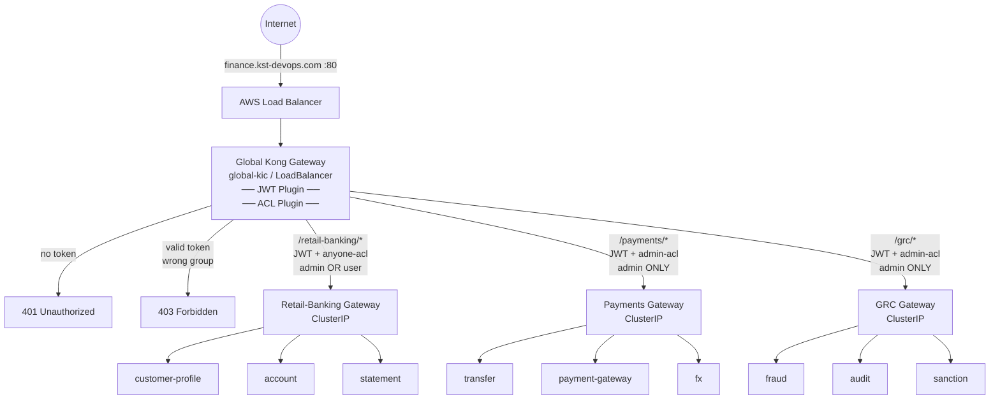
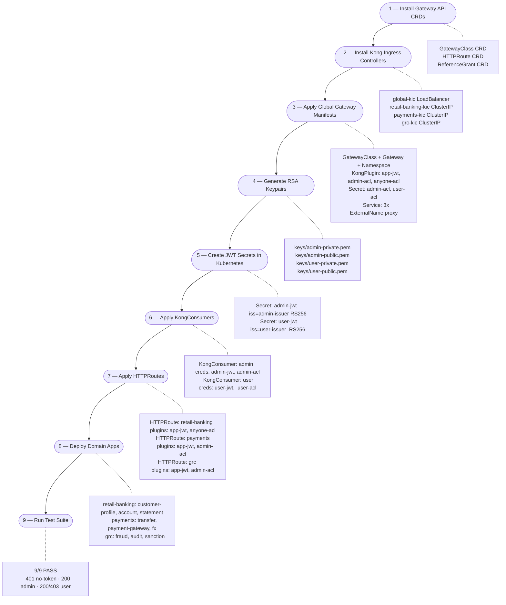

# FinGate-RBAC
### Kong API Gateway — Global JWT + Role-Based ACL on AWS EKS

A single global Kong Gateway (LoadBalancer) sits in front of three domain-specific Kong gateways (ClusterIP). All external traffic enters through one hostname (`finance.kst-devops.com`) and is authenticated with RS256 JWT before reaching any backend. Route-level ACL then enforces role separation between `admin` and `user` consumers.

- **Visual Detailed diagram (Excalidraw):** [Open in Excalidraw](https://link.excalidraw.com/l/9hD7S5FgGWN/70GLvpWZURW)
- **Manual testing guide:** [MANUAL-TEST.md](MANUAL-TEST.md)

---

## High-Level Architecture



---

## Deployment Process Flow



---

## Access Matrix

| Consumer | `/retail-banking` | `/payments` | `/grc` | ACL Plugin |
|----------|:-----------------:|:-----------:|:------:|------------|
| `admin`  | 200               | 200         | 200    | anyone-acl + admin-acl |
| `user`   | 200               | 403         | 403    | anyone-acl only |
| no token | 401               | 401         | 401    | JWT plugin rejects |

---

## File Structure

| File | Resource |
|------|---------|
| `0-gatewayclass-global.yaml` | GatewayClass: `global-kong-gatewayclass` |
| `1-kong-api-gateway-global.yaml` | Gateway + Namespace: `global-api-gateway-ns` |
| `2-kong-plugins.yaml` | KongPlugin: `app-jwt`, `admin-acl`, `anyone-acl` |
| `4-acl-secrets.yaml` | Secret: `admin-acl` (group:admin), `user-acl` (group:user) |
| `5-consumers.yaml` | KongConsumer: `admin`, `user` |
| `6-downstream-proxy-services.yaml` | ExternalName services → domain ClusterIP gateways |
| `7-retail-banking-httproute.yaml` | HTTPRoute `/retail-banking/*` → `anyone-acl` |
| `8-payments-httproute.yaml` | HTTPRoute `/payments/*` → `admin-acl` |
| `9-grc-httproute.yaml` | HTTPRoute `/grc/*` → `admin-acl` |
| `apps/` | Domain app manifests (retail-banking, payments, grc) |
| `scripts/generate-keys.sh` | Generates RSA-2048 keypairs |
| `scripts/generate-token.sh` | Signs a JWT for a given consumer |
| `scripts/test.sh` | End-to-end 9-case test suite |
| `MANUAL-TEST.md` | Step-by-step manual testing guide |

---

## Deployment Steps

### Step 1 — Install Gateway API CRDs

```bash
kubectl apply --server-side -f https://github.com/kubernetes-sigs/gateway-api/releases/download/v1.4.1/standard-install.yaml
kubectl apply --server-side -f https://github.com/kubernetes-sigs/gateway-api/releases/download/v1.4.1/experimental-install.yaml
```

### Step 2 — Install Kong Ingress Controllers

```bash
# Global KIC (LoadBalancer — the only public entry point)
helm install global-kic kong/ingress \
  --namespace global-kic --create-namespace \
  --set controller.ingressController.env.gateway_api_controller_name=konghq.com/global-kong-gateway-controller

# Retail-banking KIC (ClusterIP — internal only)
helm install retail-banking-kic kong/ingress \
  --namespace retail-banking-kic --create-namespace \
  --set controller.ingressController.env.gateway_api_controller_name=konghq.com/retail-banking-kong-gateway-controller \
  --set gateway.proxy.type=ClusterIP

# Payments KIC (ClusterIP — internal only)
helm install payments-kic kong/ingress \
  --namespace payments-kic --create-namespace \
  --set controller.ingressController.env.gateway_api_controller_name=konghq.com/payments-kong-gateway-controller \
  --set gateway.proxy.type=ClusterIP

# GRC KIC (ClusterIP — internal only)
helm install grc-kic kong/ingress \
  --namespace grc-kic --create-namespace \
  --set controller.ingressController.env.gateway_api_controller_name=konghq.com/grc-kong-gateway-controller \
  --set gateway.proxy.type=ClusterIP
```

### Step 3 — Apply Global Gateway Manifests

```bash
kubectl apply -f 0-gatewayclass-global.yaml
kubectl apply -f 1-kong-api-gateway-global.yaml
kubectl apply -f 2-kong-plugins.yaml
kubectl apply -f 4-acl-secrets.yaml
kubectl apply -f 6-downstream-proxy-services.yaml
```

### Step 4 — Generate RSA Keypairs

```bash
bash scripts/generate-keys.sh
```

### Step 5 — Create JWT Secrets

```bash
kubectl create secret generic admin-jwt \
  --namespace global-api-gateway-ns \
  --from-literal=kongCredType=jwt \
  --from-literal=key=admin-issuer \
  --from-literal=algorithm=RS256 \
  --from-literal=rsa_public_key="$(cat keys/admin-public.pem)" \
  --dry-run=client -o yaml \
  | kubectl label --local -f - konghq.com/credential=jwt -o yaml \
  | kubectl apply -f -

kubectl create secret generic user-jwt \
  --namespace global-api-gateway-ns \
  --from-literal=kongCredType=jwt \
  --from-literal=key=user-issuer \
  --from-literal=algorithm=RS256 \
  --from-literal=rsa_public_key="$(cat keys/user-public.pem)" \
  --dry-run=client -o yaml \
  | kubectl label --local -f - konghq.com/credential=jwt -o yaml \
  | kubectl apply -f -
```

### Step 6 — Apply KongConsumers

```bash
kubectl apply -f 5-consumers.yaml
```

### Step 7 — Apply HTTPRoutes

```bash
kubectl apply -f 7-retail-banking-httproute.yaml
kubectl apply -f 8-payments-httproute.yaml
kubectl apply -f 9-grc-httproute.yaml
```

### Step 8 — Deploy Domain Apps

```bash
# Retail-banking
kubectl apply -f apps/1-retail-banking/0-gatewayclass-retail-banking.yaml
kubectl apply -f apps/1-retail-banking/1-kong-api-gateway-retail-banking.yaml
kubectl apply -f apps/1-retail-banking/2-customer-profile-httproute.yaml
kubectl apply -f apps/1-retail-banking/3-customer-profile.yaml
kubectl apply -f apps/1-retail-banking/4-account.yaml
kubectl apply -f apps/1-retail-banking/5-statement.yaml

# Payments
kubectl apply -f apps/2-payments/0-gatewayclass-payments.yaml
kubectl apply -f apps/2-payments/1-kong-api-gateway-payments.yaml
kubectl apply -f apps/2-payments/2-transfer-httproute.yaml
kubectl apply -f apps/2-payments/3-transfer.yaml
kubectl apply -f apps/2-payments/4-payment-gateway.yaml
kubectl apply -f apps/2-payments/5-fx.yaml

# GRC
kubectl apply -f apps/3-grc/0-gatewayclass-grc.yaml
kubectl apply -f apps/3-grc/1-kong-api-gateway-grc.yaml
kubectl apply -f apps/3-grc/2-fraud-httproute.yaml
kubectl apply -f apps/3-grc/3-fraud.yaml
kubectl apply -f apps/3-grc/4-audit.yaml
kubectl apply -f apps/3-grc/5-sanction.yaml
```

### Step 9 — Run Tests

> See [MANUAL-TEST.md](MANUAL-TEST.md) for step-by-step curl commands and token generation.

```bash
export KONG_HOST=$(kubectl get svc global-kic-gateway-proxy -n global-kic \
  -o jsonpath='{.status.loadBalancer.ingress[0].hostname}')

bash scripts/test.sh
```

Expected output:

```
PASS /retail-banking  no token    → 401
PASS /payments        no token    → 401
PASS /grc             no token    → 401
PASS /retail-banking  admin token → 200
PASS /payments        admin token → 200
PASS /grc             admin token → 200
PASS /retail-banking  user token  → 200
PASS /payments        user token  → 403
PASS /grc             user token  → 403
Results: 9 passed, 0 failed of 9 tests
```

---

## Verify — Direct Domain Access is Blocked

```bash
# These work (routed through global gateway):
curl http://finance.kst-devops.com/retail-banking
curl http://finance.kst-devops.com/payments
curl http://finance.kst-devops.com/grc

# These are blocked (domain gateways are ClusterIP — no external IP):
curl http://retail-banking.kst-devops.com   # connection refused
curl http://payments.kst-devops.com         # connection refused
curl http://grc.kst-devops.com              # connection refused
```
