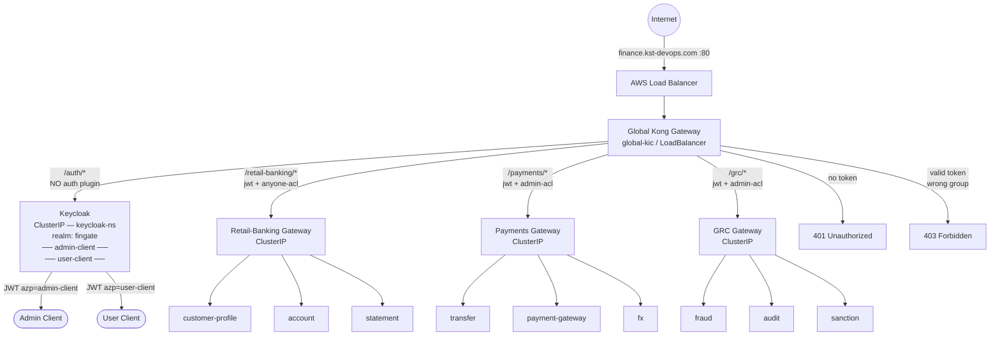
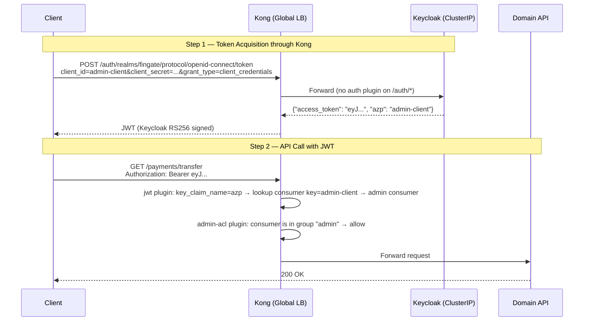
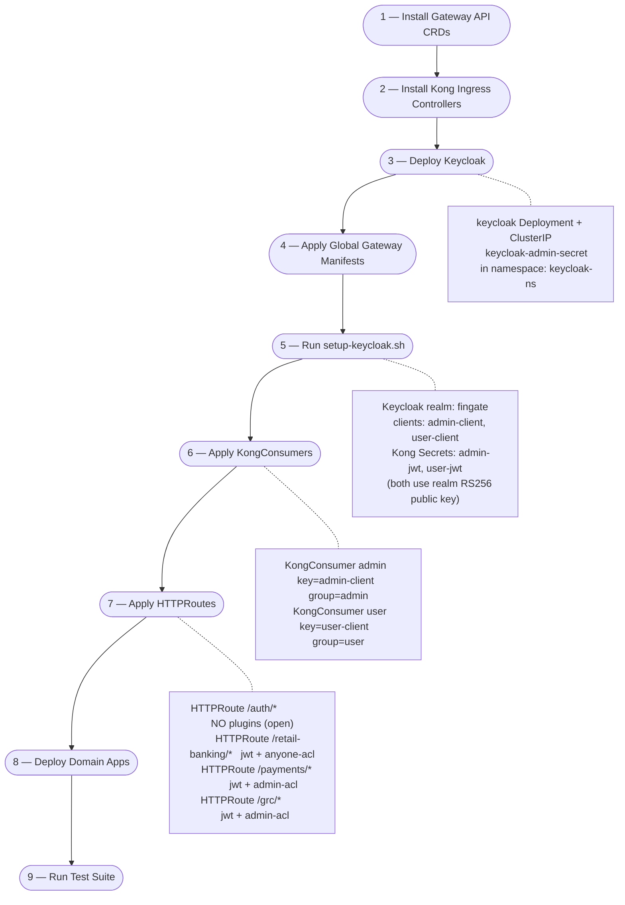

# FinGate-Keycloak
### Kong API Gateway — Keycloak OIDC Token Generation + Role-Based ACL on AWS EKS

Extends the Global JWT+RBAC architecture by replacing manual token generation with **Keycloak** as the OAuth2/OIDC identity provider. Keycloak itself is deployed as a ClusterIP service and is only reachable through Kong — clients authenticate via `finance.kst-devops.com/auth/*` and receive a Keycloak-signed JWT, which Kong then validates on every subsequent API call.

---

## Key Difference vs JWT+RBAC Solution

| Concern | JWT+RBAC (previous) | Keycloak OIDC (this solution) |
|---------|--------------------|-----------------------------|
| Token issuer | Self-signed RSA keys per consumer | Keycloak realm (centralised IdP) |
| Token acquisition | `generate-token.sh` (manual, local) | `POST /auth/realms/fingate/protocol/openid-connect/token` through Kong |
| Key management | PEM files committed to `keys/` folder | Keycloak owns its RSA keypair; public key fetched once by `setup-keycloak.sh` |
| Consumer lookup claim | `iss` (issuer) — one issuer per consumer | `azp` (authorized party = `client_id`) — all tokens share one realm issuer |
| Keycloak exposure | N/A | ClusterIP; Kong is the only entry point |
| Key rotation | Re-run key gen + re-apply secrets | Re-run `setup-keycloak.sh` to pull new realm key |

---

## High-Level Architecture



---

## Token Flow (Step by Step)



---

## Why `azp` instead of `iss`

Kong's `jwt` plugin maps a JWT claim to a KongConsumer by matching the claim value against the consumer's credential `key` field. By default it uses `iss` (issuer).

**Problem with Keycloak:** all tokens from the same realm share one issuer — `http://finance.kst-devops.com/auth/realms/fingate`. You cannot create two consumers with the same `iss`.

**Solution:** set `key_claim_name: azp`. Keycloak puts `client_id` in the `azp` (authorized party) claim:
- `admin-client` token → `azp: admin-client` → matches KongConsumer `admin` (key=`admin-client`)
- `user-client` token → `azp: user-client` → matches KongConsumer `user` (key=`user-client`)

Both consumers register the **same Keycloak realm public key** — there is only one signing key per realm.

---

## Access Matrix

| Consumer | `/auth/*` | `/retail-banking` | `/payments` | `/grc` |
|----------|:---------:|:-----------------:|:-----------:|:------:|
| anyone (no token) | 200 (open) | 401 | 401 | 401 |
| `admin-client` JWT | 200 | 200 | 200 | 200 |
| `user-client` JWT | 200 | 200 | 403 | 403 |

---

## Deployment Process



---

## File Structure

| File | Resource |
|------|----------|
| `0-gatewayclass-global.yaml` | GatewayClass: `global-kong-gatewayclass` |
| `1-kong-api-gateway-global.yaml` | Gateway + Namespace: `global-api-gateway-ns` |
| `2-keycloak-deployment.yaml` | Keycloak Deployment + ClusterIP + admin Secret |
| `2b-keycloak-httproute.yaml` | HTTPRoute `/auth/*` + ReferenceGrant for Kong → Keycloak |
| `2c-keycloak-realm-setup-ui.md` | Manual UI walkthrough — alternative to `setup-keycloak.sh` |
| `3-kong-plugins.yaml` | KongPlugin: `app-jwt` (azp), `admin-acl`, `anyone-acl` |
| `4-acl-secrets.yaml` | Secret: `admin-acl` (group:admin), `user-acl` (group:user) |
| `5-consumers.yaml` | KongConsumer: `admin` (key=admin-client), `user` (key=user-client) |
| `6-keycloak-proxy-service.yaml` | ExternalName → `keycloak.keycloak-ns.svc.cluster.local:8080` |
| `7-downstream-proxy-services.yaml` | ExternalName → 3 domain KIC ClusterIP services |
| `8-auth-httproute.yaml` | HTTPRoute `/auth/*` → Keycloak (no auth plugin) |
| `9-retail-banking-httproute.yaml` | HTTPRoute `/retail-banking/*` → `anyone-acl` |
| `10-payments-httproute.yaml` | HTTPRoute `/payments/*` → `admin-acl` |
| `11-grc-httproute.yaml` | HTTPRoute `/grc/*` → `admin-acl` |
| `apps/` | Domain app manifests (retail-banking, payments, grc) |
| `scripts/setup-keycloak.sh` | Creates Keycloak realm + clients + Kong JWT Secrets |
| `scripts/get-token.sh` | Fetches JWT from Keycloak through Kong |
| `scripts/test.sh` | 10-case end-to-end test suite |

---

## Step-by-Step Deployment

### Step 1 — Install Gateway API CRDs

```bash
kubectl apply --server-side -f https://github.com/kubernetes-sigs/gateway-api/releases/download/v1.4.1/standard-install.yaml
kubectl apply --server-side -f https://github.com/kubernetes-sigs/gateway-api/releases/download/v1.4.1/experimental-install.yaml
```

### Step 2 — Install Kong Ingress Controllers

```bash
# Global KIC (LoadBalancer — the only public entry point)
helm install global-kic kong/ingress \
  --namespace global-kic --create-namespace \
  --set controller.ingressController.env.gateway_api_controller_name=konghq.com/global-kong-gateway-controller

# Retail-banking KIC (ClusterIP — internal only)
helm install retail-banking-kic kong/ingress \
  --namespace retail-banking-kic --create-namespace \
  --set controller.ingressController.env.gateway_api_controller_name=konghq.com/retail-banking-kong-gateway-controller \
  --set gateway.proxy.type=ClusterIP

# Payments KIC (ClusterIP — internal only)
helm install payments-kic kong/ingress \
  --namespace payments-kic --create-namespace \
  --set controller.ingressController.env.gateway_api_controller_name=konghq.com/payments-kong-gateway-controller \
  --set gateway.proxy.type=ClusterIP

# GRC KIC (ClusterIP — internal only)
helm install grc-kic kong/ingress \
  --namespace grc-kic --create-namespace \
  --set controller.ingressController.env.gateway_api_controller_name=konghq.com/grc-kong-gateway-controller \
  --set gateway.proxy.type=ClusterIP
```

### Step 3 — Deploy Keycloak

```bash
kubectl apply -f 2-keycloak-deployment.yaml

# Wait for Keycloak to become ready (readiness probe: GET /auth/realms/master)
kubectl rollout status deployment/keycloak -n keycloak-ns
```

### Step 4 — Apply Global Gateway Manifests

```bash
kubectl apply -f 0-gatewayclass-global.yaml
kubectl apply -f 1-kong-api-gateway-global.yaml
kubectl apply -f 3-kong-plugins.yaml
kubectl apply -f 6-keycloak-proxy-service.yaml
kubectl apply -f 7-downstream-proxy-services.yaml
```

Create the ACL group secrets:

```bash
kubectl create secret generic admin-acl \
  --namespace global-api-gateway-ns \
  --from-literal=kongCredType=acl \
  --from-literal=group=admin \
  --dry-run=client -o yaml \
  | kubectl label --local -f - konghq.com/credential=acl -o yaml \
  | kubectl apply -f -

kubectl create secret generic user-acl \
  --namespace global-api-gateway-ns \
  --from-literal=kongCredType=acl \
  --from-literal=group=user \
  --dry-run=client -o yaml \
  | kubectl label --local -f - konghq.com/credential=acl -o yaml \
  | kubectl apply -f -
```

Create the Kong JWT Secrets (without the public key — the realm key is patched in after Keycloak is ready):

```bash
kubectl create secret generic admin-jwt \
  --namespace global-api-gateway-ns \
  --from-literal=kongCredType=jwt \
  --from-literal=key=admin-client \
  --from-literal=algorithm=RS256 \
  --dry-run=client -o yaml \
  | kubectl label --local -f - konghq.com/credential=jwt -o yaml \
  | kubectl apply -f -

kubectl create secret generic user-jwt \
  --namespace global-api-gateway-ns \
  --from-literal=kongCredType=jwt \
  --from-literal=key=user-client \
  --from-literal=algorithm=RS256 \
  --dry-run=client -o yaml \
  | kubectl label --local -f - konghq.com/credential=jwt -o yaml \
  | kubectl apply -f -
```

### Step 5 — Set Up Keycloak Realm, Clients, and Kong JWT Secrets

This step creates the Keycloak realm + clients, fetches the realm public key, and registers it as Kong JWT Secrets (`admin-jwt`, `user-jwt`).

You can either **run the script** (automated), **follow the curl-based manual steps** below, or **use the Keycloak Admin UI** — see [2c-keycloak-realm-setup-ui.md](2c-keycloak-realm-setup-ui.md) for the click-by-click walkthrough.

#### Option A — Run the script (recommended)

```bash
# auto port-forward (no KEYCLOAK_URL needed)
bash scripts/setup-keycloak.sh

# or if you have a direct URL already open
KEYCLOAK_URL=http://localhost:8090 bash scripts/setup-keycloak.sh
```

#### Option B — Manual step-by-step

**5.1 — Port-forward to Keycloak**

```bash
kubectl port-forward -n keycloak-ns svc/keycloak 8090:8080 &
# wait a few seconds for the tunnel to open
sleep 4
KC_URL="http://localhost:8090/auth"
```

**5.2 — Get a Keycloak admin token**

```bash
ADMIN_TOKEN=$(curl -sf \
  -d "client_id=admin-cli" \
  -d "username=admin" \
  -d "password=Admin@FinGate2024" \
  -d "grant_type=password" \
  "${KC_URL}/realms/master/protocol/openid-connect/token" \
  | jq -r '.access_token')

echo "Got admin token: ${ADMIN_TOKEN:0:40}..."
```

> The password `Admin@FinGate2024` must match `keycloak-admin-secret` in `2-keycloak-deployment.yaml`.

**5.3 — Create the `fingate` realm**

```bash
curl -sf -o /dev/null \
  -H "Authorization: Bearer ${ADMIN_TOKEN}" \
  -H "Content-Type: application/json" \
  -X POST "${KC_URL}/admin/realms" \
  -d '{
    "realm": "fingate",
    "enabled": true,
    "displayName": "FinGate",
    "accessTokenLifespan": 3600
  }'
echo "Realm fingate created"
```

**5.4 — Create `admin-client`**

```bash
curl -sf -o /dev/null \
  -H "Authorization: Bearer ${ADMIN_TOKEN}" \
  -H "Content-Type: application/json" \
  -X POST "${KC_URL}/admin/realms/fingate/clients" \
  -d '{
    "clientId": "admin-client",
    "enabled": true,
    "protocol": "openid-connect",
    "publicClient": false,
    "serviceAccountsEnabled": true,
    "directAccessGrantsEnabled": true,
    "secret": "admin-client-secret-2024"
  }'
echo "admin-client created"
```

**5.5 — Create `user-client`**

```bash
curl -sf -o /dev/null \
  -H "Authorization: Bearer ${ADMIN_TOKEN}" \
  -H "Content-Type: application/json" \
  -X POST "${KC_URL}/admin/realms/fingate/clients" \
  -d '{
    "clientId": "user-client",
    "enabled": true,
    "protocol": "openid-connect",
    "publicClient": false,
    "serviceAccountsEnabled": true,
    "directAccessGrantsEnabled": true,
    "secret": "user-client-secret-2024"
  }'
echo "user-client created"
```

**5.6 — Fetch the realm RS256 public key**

Keycloak uses one RSA key pair per realm. Both clients share the same signing key.

```bash
RAW_KEY=$(curl -sf "${KC_URL}/realms/fingate" | jq -r '.public_key')

# Wrap in PEM headers — Kong requires full PEM format
REALM_PUBLIC_KEY="-----BEGIN PUBLIC KEY-----
$(echo "$RAW_KEY" | fold -w 64)
-----END PUBLIC KEY-----"

echo "Public key (first 60 chars): ${RAW_KEY:0:60}..."
```

**5.7 — Patch `admin-jwt` with the realm public key**

The secret was created in Step 4 without a key. Now patch it with the Keycloak realm public key so Kong can verify tokens signed by `admin-client`.

```bash
kubectl create secret generic admin-jwt \
  --namespace global-api-gateway-ns \
  --from-literal=kongCredType=jwt \
  --from-literal=key=admin-client \
  --from-literal=algorithm=RS256 \
  --from-literal=rsa_public_key="${REALM_PUBLIC_KEY}" \
  --dry-run=client -o yaml \
  | kubectl label --local -f - konghq.com/credential=jwt -o yaml \
  | kubectl apply -f -

echo "admin-jwt patched with realm public key"
```

**5.8 — Patch `user-jwt` with the realm public key**

Same as above for `user-client`.

```bash
kubectl create secret generic user-jwt \
  --namespace global-api-gateway-ns \
  --from-literal=kongCredType=jwt \
  --from-literal=key=user-client \
  --from-literal=algorithm=RS256 \
  --from-literal=rsa_public_key="${REALM_PUBLIC_KEY}" \
  --dry-run=client -o yaml \
  | kubectl label --local -f - konghq.com/credential=jwt -o yaml \
  | kubectl apply -f -

echo "user-jwt patched with realm public key"
```

**5.9 — Verify the secrets exist**

```bash
kubectl get secrets -n global-api-gateway-ns \
  admin-jwt user-jwt \
  -o custom-columns=NAME:.metadata.name,TYPE:.type,LABELS:.metadata.labels
```

Expected output:
```
NAME        TYPE     LABELS
admin-jwt   Opaque   map[konghq.com/credential:jwt]
user-jwt    Opaque   map[konghq.com/credential:jwt]
```

> **What just happened?**
> - `admin-jwt` and `user-jwt` are now Kubernetes Secrets labelled `konghq.com/credential=jwt`.
> - Kong's KongConsumer controller watches for secrets with this label and binds them to the consumers defined in `5-consumers.yaml`.
> - When a request arrives, the `jwt` plugin reads the `azp` claim, looks up the matching secret (`key=admin-client` or `key=user-client`), and verifies the signature against the stored `rsa_public_key`.

Expected script output (Option A):

```
>>> Authenticating as Keycloak admin ...
>>> Creating realm: fingate ...
>>> Creating client: admin-client ...
>>> Creating client: user-client ...
>>> Fetching realm RS256 public key ...
>>> Creating Kong JWT Secret: admin-jwt (key=admin-client) ...
>>> Creating Kong JWT Secret: user-jwt (key=user-client) ...
━━━━━━━━━━━━━━━━━━━━━━━━━━━━━━━━━━━━━━━━━━━━━━━━━━━
  Keycloak setup complete.
  Realm:         fingate
  Admin client:  admin-client  /  secret: admin-client-secret-2024
  User client:   user-client   /  secret: user-client-secret-2024
━━━━━━━━━━━━━━━━━━━━━━━━━━━━━━━━━━━━━━━━━━━━━━━━━━━
```

### Step 6 — Apply KongConsumers

```bash
kubectl apply -f 5-consumers.yaml
```

### Step 7 — Apply HTTPRoutes

```bash
kubectl apply -f 8-auth-httproute.yaml
kubectl apply -f 9-retail-banking-httproute.yaml
kubectl apply -f 10-payments-httproute.yaml
kubectl apply -f 11-grc-httproute.yaml
```

### Step 8 — Deploy Domain Apps

```bash
# Retail-banking
kubectl apply -f apps/1-retail-banking/0-gatewayclass-retail-banking.yaml
kubectl apply -f apps/1-retail-banking/1-kong-api-gateway-retail-banking.yaml
kubectl apply -f apps/1-retail-banking/2-customer-profile-httproute.yaml
kubectl apply -f apps/1-retail-banking/3-customer-profile.yaml
kubectl apply -f apps/1-retail-banking/4-account.yaml
kubectl apply -f apps/1-retail-banking/5-statement.yaml

# Payments
kubectl apply -f apps/2-payments/0-gatewayclass-payments.yaml
kubectl apply -f apps/2-payments/1-kong-api-gateway-payments.yaml
kubectl apply -f apps/2-payments/2-transfer-httproute.yaml
kubectl apply -f apps/2-payments/3-transfer.yaml
kubectl apply -f apps/2-payments/4-payment-gateway.yaml
kubectl apply -f apps/2-payments/5-fx.yaml

# GRC
kubectl apply -f apps/3-grc/0-gatewayclass-grc.yaml
kubectl apply -f apps/3-grc/1-kong-api-gateway-grc.yaml
kubectl apply -f apps/3-grc/2-fraud-httproute.yaml
kubectl apply -f apps/3-grc/3-fraud.yaml
kubectl apply -f apps/3-grc/4-audit.yaml
kubectl apply -f apps/3-grc/5-sanction.yaml
```

### Step 9 — Run Tests

```bash
export KONG_HOST=$(kubectl get svc global-kic-gateway-proxy -n global-kic \
  -o jsonpath='{.status.loadBalancer.ingress[0].hostname}')

bash scripts/test.sh
```

Expected output:

```
━━━━━━━━━━━━━━━━━━━━━━━━━━━━━━━━━━━━━━━━━━━━━━━━━━━
  Kong-Keycloak-OIDC-Architecture — EKS test suite
━━━━━━━━━━━━━━━━━━━━━━━━━━━━━━━━━━━━━━━━━━━━━━━━━━━

[1/4] Keycloak access through Kong /auth route
PASS /auth/realms/fingate reachable (Keycloak behind Kong) (HTTP 200)

[2/4] Token acquisition through Kong → Keycloak
  Fetching admin token ...
  Fetching user token ...

[3/4] Unauthenticated requests → 401
PASS /retail-banking  no token → 401
PASS /payments        no token → 401
PASS /grc             no token → 401

[4/4] RBAC enforcement with Keycloak tokens
PASS /retail-banking  admin token → 200
PASS /payments        admin token → 200
PASS /grc             admin token → 200
PASS /retail-banking  user token  → 200
PASS /payments        user token  → 403
PASS /grc             user token  → 403

━━━━━━━━━━━━━━━━━━━━━━━━━━━━━━━━━━━━━━━━━━━━━━━━━━━
Results: 10 passed, 0 failed of 10 tests
━━━━━━━━━━━━━━━━━━━━━━━━━━━━━━━━━━━━━━━━━━━━━━━━━━━
```

---

## Manual Token Test

```bash
# Get admin token through Kong
ADMIN_TOKEN=$(bash scripts/get-token.sh admin)

# Get user token through Kong
USER_TOKEN=$(bash scripts/get-token.sh user)

# Inspect token claims (requires jq)
echo $ADMIN_TOKEN | cut -d. -f2 | base64 -d 2>/dev/null | jq '{iss,azp,exp}'

# Expected:
# {
#   "iss": "http://finance.kst-devops.com/auth/realms/fingate",
#   "azp": "admin-client",
#   "exp": 1234567890
# }

# Call APIs
curl -H "Authorization: Bearer $ADMIN_TOKEN" http://finance.kst-devops.com/retail-banking  # 200
curl -H "Authorization: Bearer $ADMIN_TOKEN" http://finance.kst-devops.com/payments        # 200
curl -H "Authorization: Bearer $USER_TOKEN"  http://finance.kst-devops.com/payments        # 403
```

---

## Verify Keycloak is NOT Directly Reachable

```bash
# This works (through Kong):
curl http://finance.kst-devops.com/auth/realms/fingate

# Keycloak ClusterIP — no external IP, cannot be reached from outside the cluster:
kubectl get svc keycloak -n keycloak-ns
# NAME       TYPE        CLUSTER-IP    EXTERNAL-IP   PORT(S)    AGE
# keycloak   ClusterIP   10.x.x.x      <none>        8080/TCP   ...
```

---

## Production Notes for EKS

- **Keycloak persistence**: replace the dev-mode in-memory H2 with RDS PostgreSQL — set `KC_DB`, `KC_DB_URL`, `KC_DB_USERNAME`, `KC_DB_PASSWORD` env vars
- **Keycloak HA**: set `replicas: 2+` and add `KC_CACHE_STACK=kubernetes` with a headless service for Infinispan cluster discovery
- **Key rotation**: when Keycloak rotates its realm signing key, re-run `setup-keycloak.sh` to refresh the Kong JWT Secrets
- **TLS**: Kong terminates TLS at the ALB; `KC_PROXY=edge` tells Keycloak to trust the `X-Forwarded-*` headers set by Kong
- **Client secrets**: store `admin-client-secret-2024` and `user-client-secret-2024` in AWS Secrets Manager and inject via External Secrets Operator
